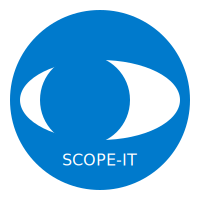

<center></center>

# SCOPE-IT
[](LICENSE)
[](https://github.com/aleph-engineering/scope-it/stargazers)
[](https://github.com/exagonsoft/scope-it/network/members)
[](https://github.com/exagonsoft/scope-it/issues)
[](https://github.com/exagonsoft/scope-it/graphs/contributors)

SCOPE-IT is a website that allows project managers and teams to perform project estimations with ease. With SCOPE-IT, you can create new projects, add team members, define tasks and estimate the time needed to complete them. SCOPE-IT helps you to plan your projects accurately and manage your team efficiently.

## Features

- Create new projects and manage them from a central dashboard.
- Add team members and assign tasks to them.
- Define tasks and estimate the time needed to complete them.
- Keep track of the progress of your project in real-time.
- Generate reports to share with your team and stakeholders.
- Customize the look and feel of SCOPE-IT to fit your brand.

## Getting Started

### Prerequisites

- Node.js (version 12 or later)
- npm (version 6 or later)

### Installation

1. Clone the repository:

```node
git clone https://gitlab.com/aleph-engineering/scope-it.git
```


2. Install dependencies:
```node
npm install
```

3. Start the development server:
```node
npm start
livecodeserver
```

4. Open your web browser and navigate to `http://localhost:3000` to access the SCOPE-IT application.

### Configuration

To configure SCOPE-IT for your needs, you can edit the `config.js` file located in the `src` directory. In this file, you can change the [default settings](poe://www.poe.com/_api/key_phrase?phrase=default%20settings&prompt=Tell%20me%20more%20about%20default%20settings.) such as the name of your company, the logo, and the colors of the application.

## Contributing

If you would like to contribute to SCOPE-IT, please follow these steps:

1. Fork the repository.
2. Create a new feature branch with a descriptive name.
3. Make your changes and commit them with a helpful message.
4. Push your changes to your forked repository.
5. Create a pull request to the `main` branch of the original repository.

## License

SCOPE-IT is licensed under the [MIT License]. See `LICENSE` for more information.

## Contact

If you have any questions or feedback, please contact us at [your-email-address].


